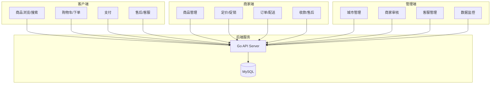

# 架构设计

## 业务域划分



## 核心实体关系

- **City** 1:N **Merchant** — 城市下多家建材商家
- **Merchant** 1:N **Product** — 商家上架商品
- **Product** 1:N **ProductMedia** — 图片/视频
- **User** N:M **Order** — 用户下单
- **Order** 1:N **OrderItem** — 订单明细
- **Order** 1:1 **Delivery** — 配送信息
- **Order** 0:N **AfterSale** — 售后工单
- **ChatSession** — 用户↔商家 / 用户↔官方客服

## 分层架构（后端）

```
HTTP Request
    → Middleware（CORS / JWT / 日志）
    → Handler（api 层，参数校验）
    → Service（业务逻辑）
    → Repository（GORM 数据访问）
    → MySQL
```

## 前端自研框架

`frontend/shared/` 提供：

- **Router** — Hash 路由，按角色加载页面
- **Http** — 统一请求封装，自动带 Token
- **Store** — 轻量状态（用户信息、城市）
- **Components** — TabBar、NavBar、ProductCard 等

三端各自 `index.html` + `app.js` + `pages/` 目录，共享 `shared/` 资源。

## 安全与权限

| 角色 | role 值 | 可访问 API |
|---|---|---|
| 普通用户 | `user` | `/api/v1/client/*` |
| 商家 | `merchant` | `/api/v1/merchant/*` |
| 管理员 | `admin` | `/api/v1/admin/*` |

JWT Token 放在 `Authorization: Bearer <token>` 请求头。

## 扩展预留

- 支付：接口层预留 `PaymentService`，后续对接微信/支付宝
- 消息：客服模块预留 WebSocket 升级点
- 小程序：H5 API 与小程序共用同一套 REST 接口
